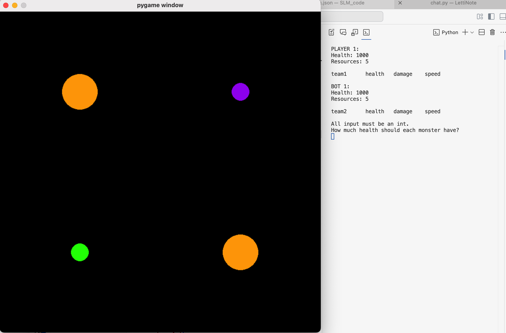
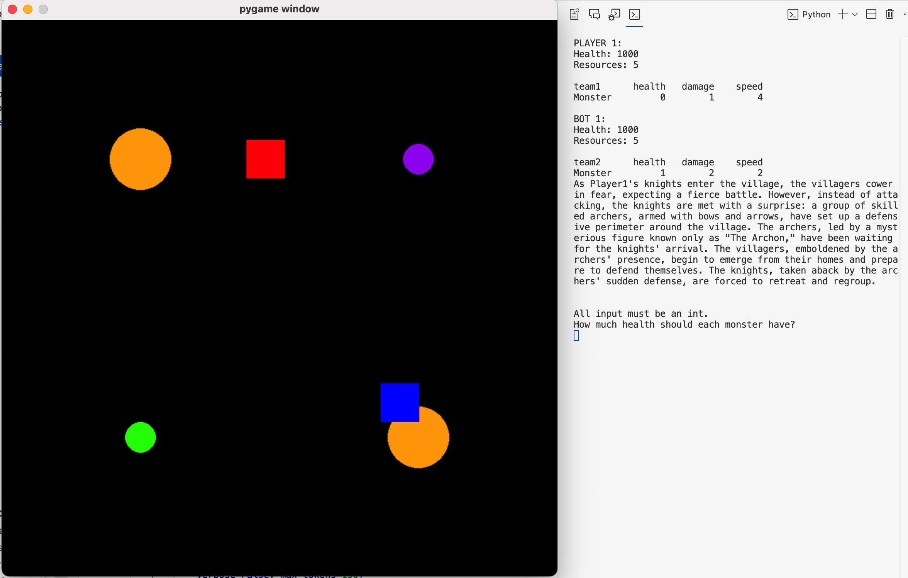
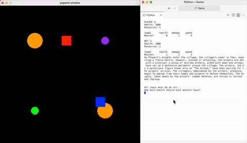

# Unit Clash: A Story Generator game

## Summary:
Unit Clash is a game where you input the stats of each unit you create which move to destroy the enemy opponent. The goal of the game is to lower the health of the enemy through sending enough of your toops to contact the enemy for a long enough period of time. As your units spawn and collide with the enemy, and your units enter the capture points, a LLM will narrate and generate a story.

The file to run to open the game is main.py. 

This game was developed as a project for HISTART at UofM.

## Opening the Game:
You play as the green circles, and your opponent is the purple circle. There are capture points which are the orange circles.

## Spawning Units:
When you input stats, you spawn blue square units and the enemy spawns red square units. These units will move to either orange capture points (0 or 1). You decide which capture point for the unit to move to, while for the enemy it is randomized. 

## Gameplay Footage:
Here is footage of the game in action. You can see the stats of the units spawned by each side in the console to the right. Additional, units delete each other if they lower each others health to 0. There is a calculation to determine unit damage and health. Additional, after each action round, the local LLM (in this case meta-llama/Llama-3.2-1B-Instruct from huggingface) is used to describe and generate the events.
